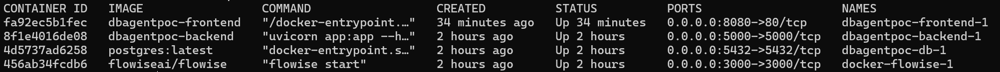

# Modern AI Assistant Setup Guide

## Prerequisites

### Install Required Software
1. **Git**: [Download and install Git](https://git-scm.com/downloads)
2. **Docker**: [Download and install Docker](https://docs.docker.com/desktop/setup/install/windows-install/)

---

## Pre-Step: OpenAI API Key and Credits

1. **Create an OpenAI API Key**:
   - Navigate to [OpenAI API Keys](https://platform.openai.com/api-keys).
   - Create a new API key and save it securely for later use.

2. **Add OpenAI Credits**:
   - Purchase $1 worth of credits for OpenAI. This is sufficient for most use cases.
   - Use this link to add credits: [OpenAI Billing](https://platform.openai.com/settings/organization/billing/overview).

---

## Project Setup

### Step 1: Clone the Repository
Run the following command to clone the project:
```
git clone git@github.com:Aaidenplays/hackathon-2025.git
```

### Step 2: Create `env.js` File and setup flowise
1. Navigate to the `frontend` folder.
2. Create a file named `env.js` and paste the following content:
   ```javascript
   export default {
       PREDICTION_ID: ""
   };
   ```
   - The `PREDICTION_ID` will be added later.
   
## Flowise Setup

### 1: Clone the Flowise Repository
Clone the Flowise GitHub project within this project directory:
```bash
git clone https://github.com/FlowiseAI/Flowise.git
```

### 2: Navigate to the Docker Folder
Open the cloned project and navigate to the following folder:
`Flowise\docker`


### 3: Rename the `.env` File
Rename the file `.env.example` to `.env`.

### 4: Update the `docker-compose.yml` File
Replace the contents of the `docker-compose.yml` file with the following configuration:
```yaml
services:
  flowise:
    image: flowiseai/flowise
    restart: always
    environment:
      - DATABASE_TYPE=postgres
      - DATABASE_HOST=db
      - DATABASE_PORT=5432
      - DATABASE_NAME=martech_data
      - DATABASE_USER=admin
      - DATABASE_PASSWORD=123
    ports:
      - '3000:3000'
    networks:
      - shared_network

networks:
  shared_network:
    external: true
```

---

## Docker Setup

### Step 3: Create a Shared Docker Network
Run the following command to create a shared network for the containers:
```
docker network create shared_network
```

### Step 4: Build and Start Docker Containers

#### 1. Build and Start the Application Containers
Navigate to the root directory and run:
```bash
docker-compose up --build -d
```
- This will build and start 3 containers: frontend, backend, and PostgreSQL database.

#### 2. Build and Start the Flowise Containers
Navigate to the docker directory and run:
```bash
docker-compose up --build -d
```
- This will build and start the Flowise container.

---

## Verify Docker Containers

1. Check the status of all containers:
   ```bash
   docker ps -a
   ```


2. Verify that all containers are part of the shared network:
   ```bash
   docker network inspect shared_network
   ```

3. If a container is not running, view its logs:
   ```bash
   docker logs <container_name>
   ```
   Example:
   ```bash
   docker logs docker-flowise-1
   docker logs dbagentpoc-frontend-1
   ```

---

## Flowise Chatflow Setup

### Step 5: Access Flowise UI
1. Open a browser and navigate to:
   ```
   http://localhost:3000/
   ```
2. Click `+ Add New` to create a new chatflow.
   - *[Insert screenshot of the "Add New" button]*

### Step 6: Load the Chatflow
1. Click the settings cogwheel and select `Load Chatflow`.
2. Import the chatflow JSON file located in the Flowise_Chatflow_Import folder.

### Step 7: Set OpenAI Credentials
1. For each `ChatOpenAI` node:
   - Expand the `Connect Credential` dropdown.
   - Select `- Create New -` and enter:
     - A custom name for the credential.
     - Your OpenAI API key.
2. Save the chatflow and refresh the page.
3. Use the saved credential for the remaining nodes.

### Step 8: Validate the Chatflow
1. Click the chat icon to test the chatflow.
   - *[Insert screenshot of the chat icon]*

2. Use the following prompt to test:
   ```
   return to me the campaign_name with the highest number of clicks from the paid social table
   ```
   - The response should include the data result and the generated query.

---

## Final Setup

### Step 9: Update `env.js`
1. Copy the hashed ID from the browser's address bar (e.g., `2f301276-0c6d-465f-8db3-136cdbc7a054`).
2. Paste it into the `PREDICTION_ID` field in `env.js`:
   ```javascript
   export default {
       PREDICTION_ID: "2f301276-0c6d-465f-8db3-136cdbc7a054"
   };
   ```

### Step 10: Rebuild the Frontend
Run the following command to recompose the frontend:
```bash
docker-compose up --build -d frontend
```

### Step 11: Access the Frontend UI
Open a browser and navigate to:
```
http://localhost:8080/
```

---

## Additional Docker Commands

- Open a bash shell in a container:
  ```bash
  docker exec -it <container_name> sh
  ```
- Query the PostgreSQL database:
  ```bash
  psql -U admin -d martech_data
  ```

---

## Notes
- Export your chatflow frequently to avoid losing progress when restarting the Flowise container.
- *[Insert screenshots of Docker Desktop, running containers, and Flowise UI as placeholders]*

---

## Setup Complete!
Start querying and enjoy your Modern AI Assistant!
